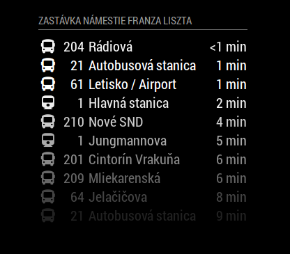

# MMM-imhdsk

This is a module for the [MagicMirror²](https://github.com/MichMich/MagicMirror/) to display
real time estimations for public transport stops in Bratislava, Slovakia.



## Installation

Go to your MagicMirror's `modules` folder and execute `git clone https://github.com/Adman/MMM-imhdsk.git`.

## Using the module

To use this module, add the following configuration block to the modules array in the `config/config.js` file:
```js
var config = {
    modules: [
        {
            module: 'MMM-imhdsk',
            header: '<name of the stop> stop',
            position: 'bottom_right',   // You can specify the region
            config: {
                stopId: id, // Id of the stop (parameter "st" in stop's livetable url)
                /* other configurations */
            }
        }
    ]
}
```

## Finding the stop ID

If you want to use this module, you need to find the `ID` of the stop. Visit
[imhd.sk](https://imhd.sk) and search for your favorite stop. Afterwards,
a livetable of this stop should appear - open this livetable in new window.
The url should contain parameter `st`, which is the stop's ID we are looking for.

## Configuration options

| Option               | Description
|--------------------- |------------
| `stopId`             | *Required* Id of the stop (parameter "st" in stop's livetable url).<br><br> **Type:** `int` <br> **Default value:** `none`
| `maximumEntries`     | *Optional* The maximum entries shown. <br><br> **Type:** `int` <br> **Default value:** `10`
| `refreshInterval`    | *Optional* How often to check for the next lines. <br><br> **Type:** `int`<br> **Default value:** `30000` milliseconds (30 seconds)
| `minimumTimeLeft`    | *Optional* Show only lines departing at least in x seconds. <br><br> **Type:** `int`<br> **Default value:** `0` seconds (turned off)
| `ignoredLines`     | *Optional* Do not display lines specified. <br><br> **Type:** `array of strings`<br> **Default value:** `[]`
| `onlyPlatforms`      | *Optional* Display only lines departing from specific platforms. If left empty, the module shows everything. <br><br> **Type:** `array of ints`<br> **Default value:** `[]`
| `fade`               | *Optional* Fade the future lines to black. (Gradient) <br><br> **Type:** `boolean`<br> **Default value:** `true`
| `fadePoint`          | *Optional* Where to start fade? <br><br> **Type:** `float`<br> **Default value:** `0.25` (start on the 1/4 th of the list)
| `blinkingUnder`      | *Optional* Time for blinking alarm. Start blinking when the arrival is in less than x seconds. <br><br> **Type:** `int`<br> **Default value:** `60` seconds
| `displaySymbol`      | *Optional* Whether to display bus/tram symbols. <br><br> **Type:** `boolean`<br> **Default value:** `true`
| `displayLineNumber`  | *Optional* Whether to display line number. <br><br> **Type:** `boolean`<br> **Default value:** `true`
| `displayDestination` | *Optional* Whether to display destination stop. <br><br> **Type:** `boolean`<br> **Default value:** `true`

*Beware that by using this you might be violating imhd.sk ToS*
